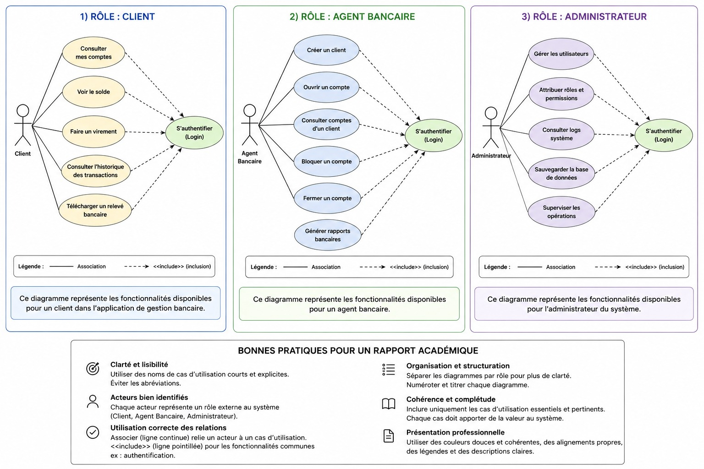
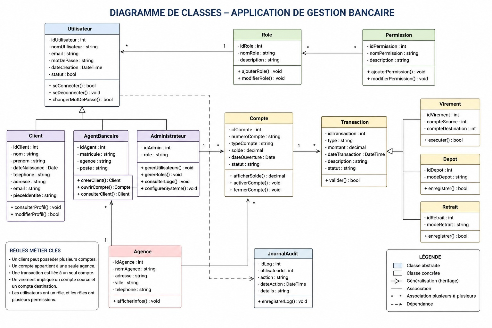

# Système de Gestion Bancaire (E-Banking Backend)

Ce projet est une application de gestion bancaire développée avec **Spring Boot 3**. Il a été conçu dans le cadre de la préparation d'un stage de développement Fullstack (Spring Boot + Angular).

## 🚀 Objectifs du Projet
L'objectif est de mettre en place une API robuste capable de gérer les opérations bancaires courantes tout en respectant une architecture logicielle propre et sécurisée.

## 🛠 Stack Technique
*   **Backend :** Java 17, Spring Boot 3
*   **Persistance :** Spring Data JPA, Hibernate
*   **Base de données :** PostgreSQL
*   **Outils :** Lombok, Maven
*   **Modélisation :** UML (Diagrammes de Cas d'Utilisation et de Classes)

## 📊 Modélisation UML
> **Note :** Les diagrammes ci-dessous représentent la structure fonctionnelle et technique du projet.

### 1. Diagramme de Cas d'Utilisation (Use Case)
Ce diagramme définit les fonctionnalités par rôle (Client, Agent Bancaire, Administrateur).


### 2. Diagramme de Classes
Ce diagramme illustre la structure des données, l'héritage des comptes et des transactions, ainsi que la gestion des rôles et permissions.


## 🔑 Fonctionnalités Principales
*   **Gestion des Utilisateurs :** Héritage complexe pour gérer les Clients, Agents et Admins.
*   **Gestion des Comptes :** Support des Comptes Courants (avec découvert) et Comptes Épargne (avec taux d'intérêt).
*   **Opérations Bancaires :** Dépôts, Retraits et Virements de compte à compte avec gestion transactionnelle.
*   **Sécurité :** Système de rôles et permissions granulaire.
*   **Audit :** Journalisation des actions système pour la traçabilité.

## ⚙️ Installation et Configuration

1.  **Cloner le projet :**
    ```bash
    git clone https://github.com/TON_PSEUDO/ebanking-backend.git
    ```

2.  **Configurer la base de données :**
    Modifier le fichier `src/main/resources/application.properties` avec vos identifiants PostgreSQL :
    ```properties
    spring.datasource.url=jdbc:postgresql://localhost:5432/ebanking_db
    spring.datasource.username=votre_utilisateur
    spring.datasource.password=votre_mot_de_passe
    ```

3.  **Lancer l'application :**
    ```bash
    mvn spring-boot:run
    ```

## 📈 Évolutions à venir
- [ ] Intégration de Spring Security avec JWT.
- [ ] Développement du Frontend avec Angular.
- [ ] Génération de relevés bancaires en PDF.
- [ ] Tests unitaires et d'intégration avec JUnit 5.

---
Développé par **Ton Nom** dans le cadre d'une préparation au stage été 2024.